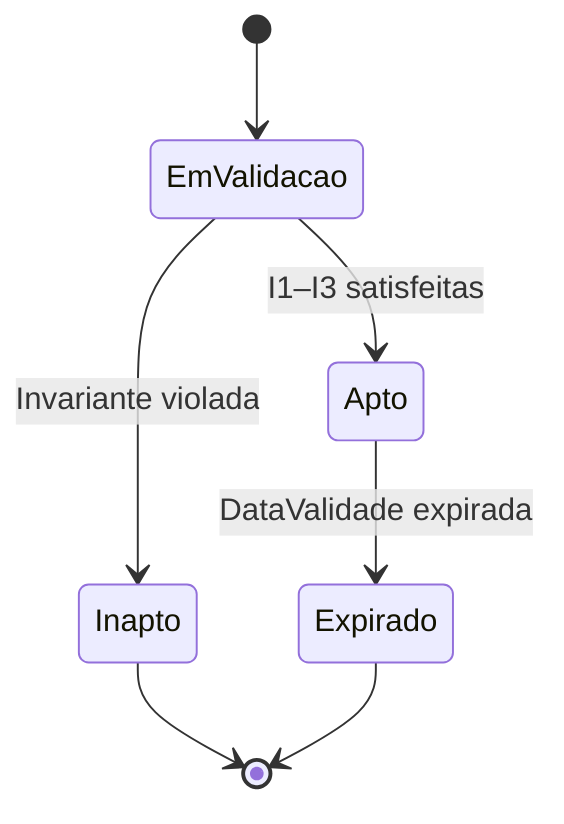
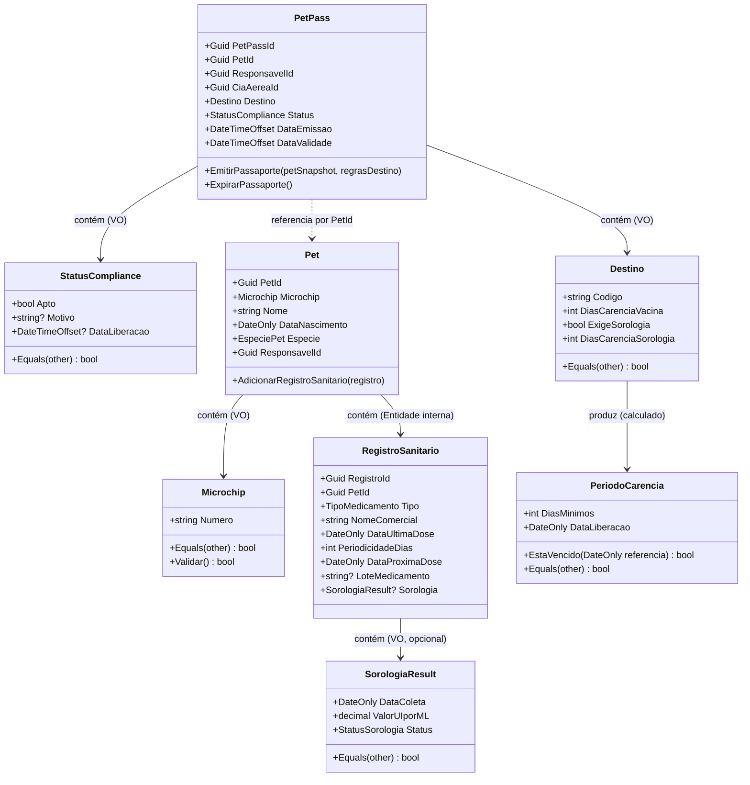

# 📚 Trabalho — Design Tático no DDD (Template para qualquer domínio)

> **Como usar:** copie este arquivo e substitua os **[colchetes]** com informações do **seu domínio** (e-commerce, marketplace, logística, educação, fintech, games, etc.).
> O objetivo é praticar Entidades, Value Objects, Agregados/AR, Repositórios e Eventos de Domínio — com foco em **invariantes** e **domínio rico**.

## 🚀 Quick start (5 passos)

1. Escolha um **domínio** que você conheça (ex.: **[Seu Domínio]**).
2. Liste 3–7 **invariantes** que devem estar corretas no **commit**.
3. Escolha 1–2 **Agregados principais** (comece por **[Agregado Principal]**).
4. Desenhe a **máquina de estados** e os **eventos** que surgem das transições.
5. Defina o **Repositório**

## 🩺 1) Sobre o Domínio Escolhido

### Nome do domínio:

**PET Pass — Compliance Sanitário** (Core Domain do iPet)

### Objetivo do sistema:

Emitir e validar o passaporte sanitário digital (Pet Pass), garantindo que cada animal esteja apto para embarque aéreo conforme as regras regulatórias do destino (VIGIAGRO, UE, Japão).

### Principais atores:

Responsável pelo Pet, Veterinário, Agente de Aeroporto, Companhia Aérea, agências regulatórias

### Contextos (Bounded Contexts):

- **PET Pass** (Core Domain) — passaporte digital e motor de compliance
- **Gestão de Saúde** (Core Domain) — vacinas, vermífugos e cronogramas médicos
- **Cadastro de Pets** (Supporting) — dados biométricos e cadastrais
- **Veterinários** (Supporting) — validação de profissionais e atestados digitais
- **Cias. Aéreas** (Supporting) — regras específicas por companhia e rota
- **Pagamentos** (Generic) — processamento via Mercado Pago

## 🧩 2) Entidades vs Value Objects

Preencha a tabela justificando cada tipo (identidade vs. imutabilidade).

| Elemento              | Tipo (Entidade/VO) | Por quê? (identidade/imutável)                                                                                 |
| --------------------- | ------------------ | -------------------------------------------------------------------------------------------------------------- |
| **PetPass**           | Entidade (AR)      | Identidade própria por `PetPassId`; ciclo de vida rastreável (emissão → validade → expiração).                 |
| **Pet**               | Entidade (AR)      | Identidade via `Microchip` (físico, único); ciclo de vida independente do PetPass.                             |
| **Responsável**       | Entidade           | Identidade própria (usuário do Super App); pode possuir múltiplos pets.                                        |
| **RegistroSanitario** | Entidade interna   | Identidade por `RegistroId`; representa um evento de saúde imutável (dose aplicada), mas rastreável por ID.    |
| **Microchip**         | Value Object       | Imutável após implante; igualdade por valor (string de 15 dígitos ISO); sem ciclo de vida próprio.             |
| **StatusCompliance**  | Value Object       | Resultado imutável da avaliação sanitária (`Apto`/`Inapto` + motivo + `dataLiberacao?`); igualdade por valor.  |
| **Destino**           | Value Object       | Representa o destino da viagem (`BRASIL`, `UNIAO_EUROPEIA`, `JAPAO`); imutável; igualdade por valor.           |
| **SorologiaResult**   | Value Object       | Resultado sorológico imutável após registro (valor em UI/mL + data + status `OK`/`Pendente`).                  |
| **PeriodoCarencia**   | Value Object       | Intervalo imutável de carência (`DiasMinimos`, `DataLiberacao`); calculado a partir da sorologia e do destino. |

> Dica: Promova tipos semânticos: `Email`, `CPF/CNPJ`, `Money`, `IntervaloDeTempo`, `Endereco`, `Percentual`, `Quantidade`, etc. **VOs devem ser imutáveis** e com **igualdade por valor**.

## 🏗️ 3) Agregados e Aggregate Root (AR)

**Agregado Principal:** **`PetPass`**  
**Conteúdo interno do agregado (apenas o necessário para consistência local):**

- **`StatusCompliance`** (VO) — resultado atual da avaliação (Apto/Inapto + motivo)
- **`Destino`** (VO) — destino da viagem que determina as regras a aplicar
- **`DataEmissao`** (VO / DateTimeOffset) — momento imutável de criação do passaporte
- **`DataValidade`** (VO / DateTimeOffset) — limite de validade do passaporte

**Referências a outros agregados (por ID):**

- **`PetId`** — referência à AR `Pet` (Bounded Context: Cadastro de Pets)
- **`ResponsavelId`** — referência à entidade `Responsavel` (usuário do Super App)
- **`CiaAereaId`** — referência à AR `CiaAerea` (Supporting Domain)

**Boundary — Por que cada item está dentro/fora?**

- **Dentro:** `StatusCompliance` e `Destino` precisam de **consistência transacional** - a regra de compliance (`StatusCompliance`) só é válida em relação a um `Destino` específico, e ambos devem mudar juntos na mesma transação.
- **Fora:** `Pet` fica fora porque pertence a um Bounded Context distinto (Cadastro de Pets) e pode ser atualizado independentemente; o `PetPass` só precisa de `PetId` para referenciar. Da mesma forma, `RegistroSanitario` (vacinas, sorologia) é gerenciado pelo Bounded Context de Gestão de Saúde – o `PetPass` consome o resultado da validação, não armazena os registros primários.

## 🧭 4) Invariantes e Máquina de Estados

Liste invariantes (devem ser verdadeiras ao final de cada transação).

**Invariantes:**

- **[I1] Carência mínima de vacina antirrábica** — Um `PetPass` nunca pode ser emitido como `Apto` se a data da vacina for inferior a 21 dias antes da data de embarque, independentemente do destino.
- **[I2] Sorologia obrigatória para voos internacionais (UE)** — Para destino `UNIAO_EUROPEIA`, o status `Apto` exige vacina válida (I1) **e** sorologia com carência ≥ 90 dias após a data da coleta.
- **[I3] Sorologia com carência estendida para o Japão** — Para destino `JAPAO`, o status `Apto` exige vacina válida (I1) **e** sorologia com carência ≥ 180 dias após a data da coleta.
- **[I4] Imutabilidade do passaporte emitido** — Um `PetPass` com status `Apto` não pode ser retroativamente alterado; se o contexto sanitário mudar, um novo `PetPass` deve ser gerado.
- **[I5] Existência prévia de Pet e Responsável** — Não é possível criar um `PetPass` sem `PetId` e `ResponsavelId` válidos e previamente registrados no sistema.
- **[I6] Validade não retroativa** — A `DataValidade` de um `PetPass` deve ser sempre posterior à `DataEmissao`.

**Estados e transições da AR `PetPass`:**



Regras:

- `EmValidacao → Apto`: permitida se todas as invariantes I1–I3 são satisfeitas para o `Destino` informado.
- `EmValidacao → Inapto`: ocorre quando qualquer invariante é violada; o motivo e a `dataLiberacao` (quando calculável) são registrados no `StatusCompliance`.
- `Apto → Expirado`: transição automática quando `DataValidade < DateTime.UtcNow`; disparada por job periódico.
- `Inapto → Apto`: **bloqueada no mesmo agregado**; um novo `PetPass` deve ser criado após a regularização sanitária.
- `Expirado → qualquer`: **bloqueada**; passaporte expirado é imutável.

## 🗃️ 5) Repositório do Agregado (interface)

> Repositório trabalha **apenas com a AR**, sem expor entidades internas do agregado. Consultas analíticas ficam fora (read models).

**Linguagem livre** (ex.: C#, Java, Kotlin, TS). Exemplo (C# assíncrono, adapte nomes):

```csharp
public interface IPetPassRepository
{
    /// <summary>
    /// Recupera um PetPass pelo seu identificador único.
    /// </summary>
    Task<PetPass?> ObterPorIdAsync(Guid petPassId, CancellationToken ct = default);

    /// <summary>
    /// Lista todos os PetPasses associados a um Pet (histórico de passaportes).
    /// </summary>
    Task<IReadOnlyList<PetPass>> ListarPorPetAsync(Guid petId, CancellationToken ct = default);

    /// <summary>
    /// Persiste um novo PetPass recém-criado.
    /// </summary>
    Task AdicionarAsync(PetPass petPass, CancellationToken ct = default);

    /// <summary>
    /// Salva mudanças em um PetPass existente (ex.: transição para Expirado).
    /// </summary>
    Task SalvarAsync(PetPass petPass, CancellationToken ct = default);
}
```

## 📣 6) Eventos de Domínio

Defina **2–4 eventos** com **payload mínimo** e **momento de publicação** (preferir **pós-commit**). Diferencie **evento interno** vs **evento de integração**.

| Evento                    | Quando ocorre                                           | Payload mínimo                                                   | Interno/Integração | Observações                                                                                          |
| ------------------------- | ------------------------------------------------------- | ---------------------------------------------------------------- | ------------------ | ---------------------------------------------------------------------------------------------------- |
| **`PetPassEmitido`**      | Ao concluir validação com status `Apto`                 | `petPassId`, `petId`, `responsavelId`, `destino`, `dataValidade` | Integração         | Consumido por Cias. Aéreas (check-in) e Notificações. Deve ser idempotente por `petPassId`.          |
| **`ComplianceReprovado`** | Ao concluir validação com status `Inapto`               | `petPassId`, `petId`, `destino`, `motivo`, `dataLiberacao?`      | Interno            | Aciona alerta push ao Responsável via BC de Comunicação; `dataLiberacao` presente quando calculável. |
| **`PetPassExpirado`**     | Quando `DataValidade < DateTime.UtcNow` (job periódico) | `petPassId`, `petId`, `destino`, `dataExpiracao`                 | Integração         | Consumido por Cias. Aéreas para invalidar referências ao passaporte. Job deve ser idempotente.       |
| **`SorologiaRequerida`**  | Ao reprovar por ausência ou insuficiência de sorologia  | `petId`, `responsavelId`, `destino`, `prazoMinimoEmDias`         | Interno            | Aciona notificação push e agenda lembrete no BC de Gestão de Saúde para coletar sorologia.           |

## 🗺️ 8) Diagrama (Mermaid)

> Mostre **Agregados/AR**, **VOs** e **relacionamentos por ID** entre agregados (não “contenha” outros agregados).



## ✅ Checklist de Aceitação

- [x] **VOs imutáveis** e com **igualdade por valor** (nada de “string de CPF/Email”).
- [x] **Boundary do agregado** pequeno e com **invariantes claras**.
- [x] **Domínio rico**: operações do negócio como métodos (evitar `set` aberto).

## 📤 Entrega

- **Inclua**: link/imagem do **diagrama** + todas as seções acima preenchidas.
