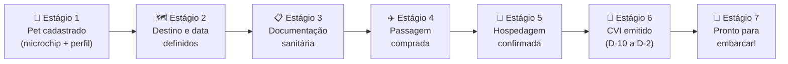

# iPet — Arquitetura da Jornada do Responsável
**Versão:** 1.0 | **Autores:** Danielle Moreira (CEO), Victor Hugo Telles (CTO), Brunna Rosa (CPO), Leonardo Braga de Almeida (COO) | **Data:** 2026-04-17

> **Insight fundacional:** O usuário não sabe por onde começar. Saber o que precisa fazer não é suficiente — ele precisa ver a jornada completa, entender onde está, o que vem a seguir e como o iPet pode fazer por ele o que ele não quer ou não sabe fazer.

---

## 1. O Problema Central

A maior dor não é a falta de informação — é a **desorientação na sequência**.

> "Primeiro compro a passagem ou primeiro faço os exames?"

A resposta certa — "depende do destino e do prazo" — exige conhecimento que o tutor não tem. O iPet existe para eliminar essa dúvida e guiar o usuário do ponto zero até o embarque com confiança.

**Referências de jornada guiada que resolvem isso:**

| App | Problema que resolve | Como guia |
|-----|---------------------|-----------|
| **Mercado Livre** | "Onde está meu pedido?" | Estágios visuais: Confirmado → Preparando → A caminho → Entregue |
| **iFood** | "Quando chega minha comida?" | Tracker em tempo real com etapas |
| **Duolingo** | "Como aprendo um idioma?" | Caminho visual com etapas desbloqueáveis e gamificação |
| **Nubank** | "Como está minha conta?" | Status em tempo real na home, sem precisar navegar |

**Para o iPet:** o usuário precisa de um tracker tipo Mercado Livre, mas para a jornada de compliance do pet.

---

## 2. A Jornada Completa — 7 Estágios



### Detalhamento por estágio

| Estágio | Critério de conclusão | Alerta de bloqueio |
|---------|----------------------|-------------------|
| **1 — Pet cadastrado** | Perfil completo: espécie, raça, peso, microchip | "Seu pet não tem microchip — necessário para viajar internacionalmente" |
| **2 — Destino definido** | Plano de viagem criado com destino + data de embarque | "Japão/Austrália: comece agora — prazo mínimo 7–8 meses" |
| **3 — Documentação** | Roadmap 100% concluído (todas as tarefas CONCLUIDA) | Cada tarefa pendente com prazo e ação disponível |
| **4 — Passagem comprada** | Comprovante anexado ou voo vinculado | "Se mudar a CIA, as regras de peso/raça podem mudar" |
| **5 — Hospedagem** | Opcional — hotel pet-friendly confirmado | "X hotéis pet-friendly no seu destino" |
| **6 — CVI emitido** | Disponível apenas D-10 a D-2 do embarque | "Emita entre [data] e [data]" |
| **7 — Pronto!** | Todos os anteriores + checklist de embarque completo | — |

---

## 3. Produtos iPet em Cada Estágio

O iPet não é apenas informação — é também **execução**. Em cada etapa com atrito, oferecemos 3 níveis de ajuda:

```
📍 INDICAR → mostrar onde resolver (clínicas, parceiros)
📅 FACILITAR → agendar pelo app (comissão para iPet)  
🛒 EXECUTAR → iPet faz por você (serviço próprio ou parceiro)
```

### Mapa de produtos por estágio

| Estágio | Produto iPet | Modelo | Receita |
|---------|-------------|--------|---------|
| 1 — Microchip | Agendar implante em clínica parceira | Facilitar | 15% comissão |
| 1 — Microchip | Kit microchip (venda) | Executar | Margem direta |
| 3 — Vacina | Agendar vacinação | Facilitar | 15% comissão |
| 3 — Sorologia | Clínica credenciada MAPA próxima | Indicar/Facilitar | 15% comissão |
| 3 — CVI | Agendar com vet credenciado | Facilitar | 15% comissão |
| 4 — Passagem | Busca Skyscanner (só cias que aceitam o pet) | Indicar | CPA Skyscanner |
| 5 — Hotel | Hotéis pet-friendly no destino | Indicar | CPA Booking/parceiro |
| Qualquer | Seguro pet de viagem | Indicar | 15–20% CPA |
| Qualquer | Caixa de transporte IATA | Vender | Margem direta |

---

## 4. Arquitetura do Journey Hub (tela principal)

Quando há uma viagem ativa, a home do app se transforma no **Journey Hub**:

```
┌─────────────────────────────────────────────────────┐
│  🐾 Max  →  🇯🇵 Japão                               │
│  ✈️ Embarque em 127 dias — 12 de agosto de 2026     │
│                                                      │
│  ──── Progresso ──────────────────────── 42% ────  │
│  ████████████░░░░░░░░░░░░░░░░░░░░░░░░░░░░░░░░       │
│                                                      │
│  ✅  Estágio 1 — Pet cadastrado                     │
│  ✅  Estágio 2 — Destino definido                   │
│  🔄  Estágio 3 — Documentação (3 / 7)    ← AQUI    │
│  ○   Estágio 4 — Passagem                           │
│  ○   Estágio 5 — Hospedagem                         │
│  🔒  Estágio 6 — CVI (disponível em 117 dias)      │
│  ○   Estágio 7 — Pronto para embarcar!              │
│                                                      │
│  ┌─────────────────────────────────────────────┐   │
│  │ 📌 Próxima ação                             │   │
│  │ Agendar sorologia — prazo: 20 mai           │   │
│  │ [Ver clínicas próximas]  [iPet agenda]      │   │
│  └─────────────────────────────────────────────┘   │
└─────────────────────────────────────────────────────┘
```

### Estados dos estágios

```
✅  Concluído       → verde, check
🔄  Em andamento   → azul, progresso X/Y
○   Não iniciado   → cinza, aguardando anterior
🔒  Bloqueado      → cadeado, motivo exibido
⚠️  Atenção        → amarelo, prazo curto
```

---

## 5. Estimativa de Custo — Transparência Total

Antes de iniciar a jornada, o usuário vê o custo total estimado:

```
💰 Estimativa para Max viajar ao Japão

Já pago
  ✅ Microchip                    R$ 120
  ✅ Vacina antirrábica           R$ 150

A pagar (obrigatório)
  ⏳ Sorologia FAVN               R$ 400–800
  ⏳ CVI (emissão)                R$ 200–400
  ⏳ Taxa embarque ANA/JAL        ¥ 20.000 (~R$ 700)

A pagar (recomendado)
  ○  Caixa de transporte IATA    R$ 200–500
  ○  Seguro pet de viagem        R$ 300–600

Total estimado: R$ 1.770 – R$ 3.270
```

---

## 6. Resposta para "Por onde começo?"

Fluxo do wizard de onboarding de viagem (máx. 3 perguntas):

```
Pergunta 1: Para onde você quer ir?
  → Resposta: Japão

Pergunta 2: Quando você quer viajar?
  → Resposta: Dezembro 2026

Pergunta 3: Seu pet já tem microchip e vacina antirrábica em dia?
  → Resposta: Só vacina, microchip não tem

RESULTADO:
"Para o Japão em dezembro, você tem 8 meses.
 Mas precisa do microchip ANTES de refazer a vacina.
 ⚠️ A sorologia tem 180 dias de carência — comece AGORA.
 
 Data mais cedo possível para embarcar: 15 de nov 2026 ✓
 
 [Montar meu roadmap completo]"
```

---

## 7. Modo Aeroporto — dia do embarque

Ativado automaticamente quando faltam < 24h para o voo:

```
🛫 MAX — LATAM 3088 → TÓQUIO
Embarque: hoje, 14h30 · Terminal 3 · Portão G22

DOCUMENTOS (apresentar nesta ordem):
[ ] 1. Passaporte digital do pet (QR Code) ← toque aqui
[ ] 2. Vacina antirrábica (certificado original)
[ ] 3. Sorologia FAVN (resultado + tradução juramentada)
[ ] 4. CVI original com apostilamento
[ ] 5. Formulário LATAM para transporte de animais

CONTATOS DE EMERGÊNCIA:
📞 LATAM Pets: 0800-570-5905
💬 Suporte iPet: chat
🏥 Vet de plantão: (11) 9xxxx-xxxx
```

---

## 8. Status das Features de Journey por Release

| Feature | Status | Prioridade |
|---------|--------|-----------|
| Timeline visual do roadmap | ✅ Entregue (abr/2026) | — |
| Journey Hub — Central da Viagem | 📋 Backlog F1A | Máxima |
| Onboarding "Por onde começo?" | 📋 Backlog F1A | Máxima |
| Estimativa de custo total | 📋 Backlog F1A | Alta |
| iPet Services — Marketplace | 📋 Backlog F1A | Alta |
| Passagem comprada (vincular voo) | 📋 Backlog F1B | Média |
| Modo Aeroporto | 📋 Backlog F1B | Média |
| Compliance de retorno | 📋 Backlog F1C | Baixa |

---

## 9. Princípio de Design

> **"O usuário nunca deve se perguntar 'o que faço agora?'"**

Cada tela do iPet deve sempre responder a pergunta implícita do usuário:
1. **Onde estou?** — estágio atual destacado
2. **O que está pendente?** — próxima ação sempre visível
3. **Como o iPet me ajuda?** — produto/serviço contextual disponível
4. **Quando preciso agir?** — prazo e urgência sempre claros

---

*Documento vivo — atualizar a cada nova feature ou decisão de produto.*
