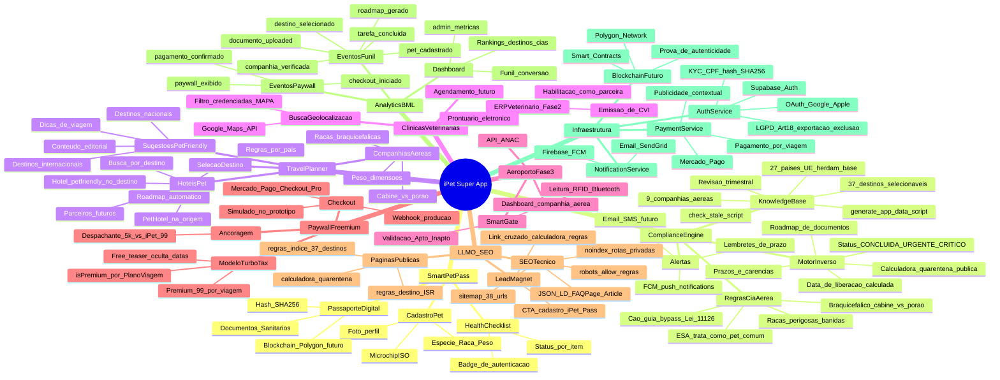
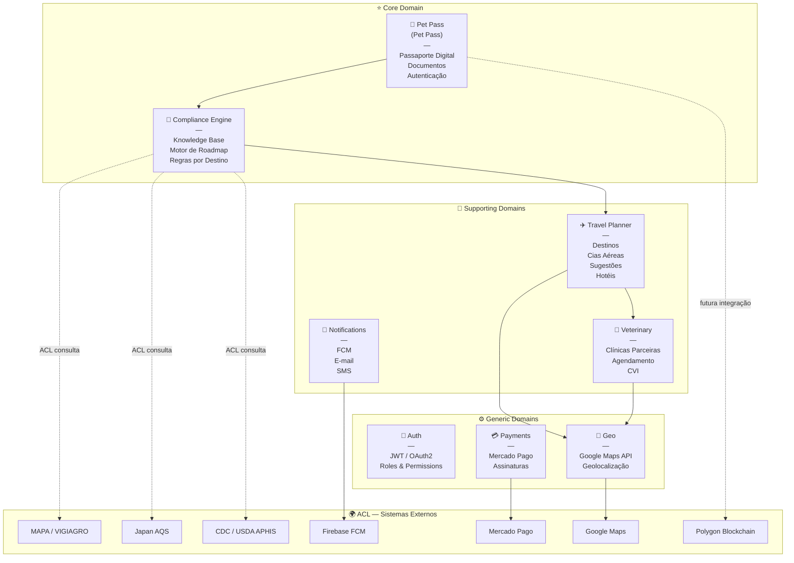
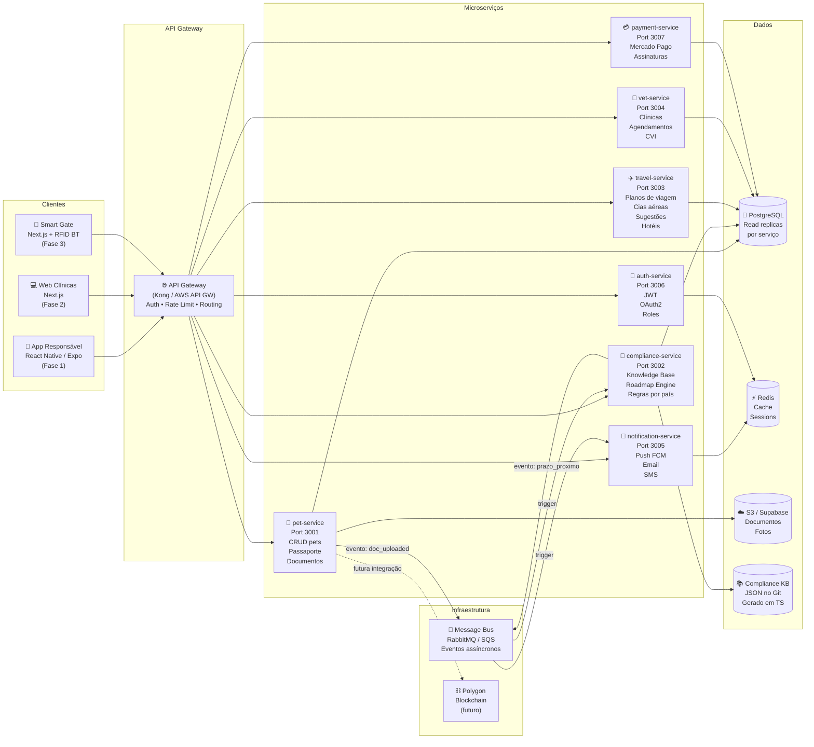
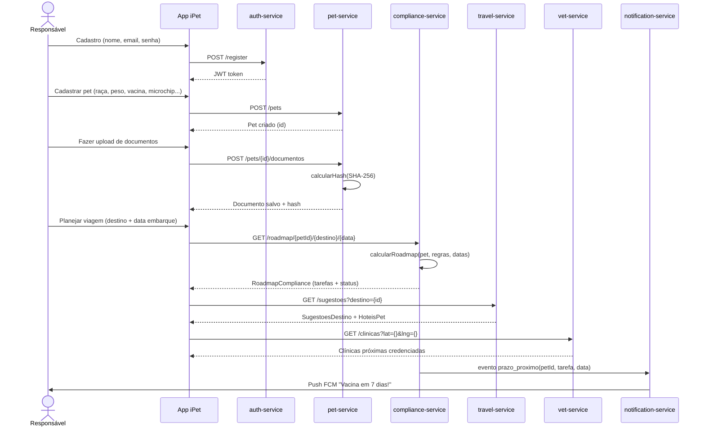

# iPet — Arquitetura do Super App
**Versão:** 1.1 | **Autores:** Danielle Moreira (CEO), Victor Hugo Telles (CTO), Brunna Rosa (CPO), Leonardo Braga de Almeida (COO) | **Data:** 2026-04-24

> **Regra de ouro:** documentar é tão importante quanto desenvolver. Este arquivo é o mapa vivo da plataforma — atualizar a cada nova feature ou decisão arquitetural.

---

## Índice

1. [Visão Geral](#visão-geral)
2. [MindMap — Tudo o que o iPet faz](#mindmap)
3. [Domain-Driven Design — Bounded Contexts](#ddd)
4. [Arquitetura de Microserviços](#microservicos)
5. [Fluxo de Dados — Jornada do Responsável](#fluxo)
6. [Mapa de Features — Status Atual](#mapa-features)
7. [Decisões Arquiteturais Registradas](#decisoes)
8. [Stack por Serviço](#stack)

---

## 1. Visão Geral {#visão-geral}

O **iPet** é um Super App Pet organizado em 3 fases de release:

| Fase | Público | Produto | Status |
|------|---------|---------|--------|
| **1** | Responsável pelo pet | Pet Pass — jornada pré-embarque | **Em desenvolvimento** |
| **2** | Clínicas veterinárias | ERP Vet + habilitação como parceira de negócio | Planejado |
| **3** | Companhias aéreas | Smart Gate RFID + motor de compliance no aeroporto | Futuro (hardware) |

**Modelo de negócio:** CSaaS — Compliance Sanitário as a Service.  
O iPet cobra uma assinatura pelo acesso à plataforma (responsável, clínica, companhia) e gera receita adicional via publicidade contextual (parceiros pet-friendly, hotéis, seguros).

---

## 2. MindMap — Tudo o que o iPet faz {#mindmap}

---

## 3. Domain-Driven Design — Bounded Contexts {#ddd}

### Descrição por Contexto

| Contexto | Tipo | Responsabilidade | Entidades Principais |
|----------|------|-----------------|----------------------|
| **Pet Pass** | Core | Identidade digital do pet + passaporte sanitário | `Pet`, `DocumentoSanitario`, `PassaportePet` |
| **Compliance Engine** | Core | Regras sanitárias por destino + roadmap inverso | `RegrasDestino`, `RoadmapCompliance`, `TarefaRoadmap` |
| **Travel Planner** | Supporting | Planejamento de viagem + sugestões + hotéis | `PlanoViagem`, `RegrasCompanhiaAerea`, `SugestaoDestino`, `HotelPet` |
| **Veterinary** | Supporting | Clínicas parceiras + agendamento + emissão de CVI | `Clinica`, `Agendamento`, `CVI` |
| **Notifications** | Supporting | Alertas de prazo + push + email | `Notificacao`, `Template` |
| **Auth** | Generic | Autenticação e autorização multi-role | `Usuario`, `Role`, `Token` |
| **Payments** | Generic | Assinaturas + cobranças | `Assinatura`, `Fatura` |
| **Geo** | Generic | Geolocalização + busca por proximidade | `Coordenadas`, `PlaceResult` |

---

## 4. Arquitetura de Microserviços {#microservicos}

### Responsabilidades por Serviço

#### `pet-service` — Identidade do Pet
- CRUD de pets e responsáveis
- Upload e hash SHA-256 de documentos (S3)
- Geração do Passaporte PDF
- Futuramente: registro de hash na blockchain Polygon

#### `compliance-service` — Motor de Compliance
- Serve os dados do compliance-kb (gerado de JSONs curados)
- Recebe `petId + destinoId + dataEmbarque` e retorna roadmap completo
- Expõe endpoint `GET /roadmap/{petId}/{destino}/{dataEmbarque}`
- Expõe endpoint `GET /destinos` e `GET /companhias`
- Publica eventos no bus quando um prazo está próximo

#### `travel-service` — Planejamento de Viagem
- CRUD de planos de viagem
- Listagem de destinos com conteúdo editorial (pet-friendly tips)
- Listagem de hotéis pet (cache Google Places + parceiros)
- Sugestões de destinos com base no perfil do pet

#### `vet-service` — Clínicas Veterinárias
- Busca de clínicas credenciadas (Google Maps + base própria)
- Agendamento de consultas
- (Fase 2) ERP: prontuários, emissão de CVI, habilitação de parceria

#### `notification-service` — Notificações
- Lembra responsáveis de prazos críticos via push FCM
- Templates de e-mail para onboarding e alertas
- Agenda lembretes com base nos dados do roadmap

#### `auth-service` — Autenticação
- JWT stateless com refresh tokens
- Roles: `TUTOR`, `VET`, `AIRLINE_AGENT`, `ADMIN`
- (Futuro) OAuth2 com Google / Apple Sign In

#### `payment-service` — Pagamentos
- Assinaturas via Mercado Pago Subscriptions
- Planos: Free (1 pet), Pro (até 5 pets), Clinic (por clínica)
- Webhooks de pagamento confirmado

---

## 5. Fluxo de Dados — Jornada do Responsável {#fluxo}

---

## 6. Mapa de Features — Status Atual {#mapa-features}

### Legenda
- ✅ Implementado (neste protótipo)
- 🔨 Em implementação
- 📋 Planejado (próximas sprints)
- 🔮 Futuro (roadmap longo prazo)

### Fase 1 — Responsável pelo Pet

| Feature | Status | Descrição |
|---------|--------|-----------|
| Cadastro de pet | ✅ | Multi-step form: espécie, raça, peso, vacina, sorologia, tipo (comum/cão-guia) |
| Passaporte Digital | ✅ | Identidade + checklist de saúde + badges de autenticação |
| Upload de documentos | ✅ | Armazenamento local + hash SHA-256 |
| QR Code do passaporte | ✅ | SVG nível H + página pública `/verificar/[petId]` |
| Motor de compliance | ✅ | Roadmap inverso: dado pet + destino + data → tarefas ordenadas |
| Plano de viagem | ✅ | Seleção destino + data embarque + roadmap + salvar |
| **37 destinos no KB** | ✅ | 27 UE (herdam regra base) + Brasil, UK, Argentina, Chile, Uruguai, Canadá, Austrália, México, Japão, EUA |
| **9 cias no KB** | ✅ | LATAM, GOL, Azul, TAP, Air France, Iberia, Copa, American, Emirates |
| Compliance KB offline | ✅ | JSONs curados + check-stale.ts + generate-app-data.ts + herança entre destinos |
| Journey Hub | ✅ | 7 estágios com progresso ponderado, próxima ação contextual |
| Wizard "Por onde começo?" | ✅ | 3 passos → diagnóstico viável/inviável + data mínima |
| Estimativa de custo total | ✅ | KB curado por destino, já pago vs. pendente, faixas min–max |
| Comparador pet × cia aérea | ✅ | Veredicto Cabine/Porão/Restrição/Recusado + side-by-side até 4 cias |
| Modelo granular braquicefálico | ✅ | `braquicefalicoCabine` / `braquicefalicoPorao` separados |
| Cão-guia / ESA | ✅ | Bypass Lei 11.126/2005 para cão-guia; ESA tratado como pet comum |
| Checklist de embarque | ✅ | `/embarque/[planoId]` dinâmico por pet/destino/cia (5 categorias) |
| Clínicas veterinárias MVP | ✅ | 11 clínicas curadas (SP/RJ/MG/PR), geoloc + filtros, lead gen tracking |
| Sugestões pet-friendly + hotéis | ✅ | Cards editoriais + duas abas (origem / destino) |
| Paywall TurboTax | ✅ | `isPremium` por PlanoViagem, teaser oculta datas, banner de ancoragem |
| Checkout simulado | ✅ | `/checkout/[planoId]` + `/checkout/sucesso` — Mercado Pago real pendente |
| LLMO — páginas públicas `/regras` | ✅ | Índice + 37 destinos + JSON-LD (FAQPage/Article) + sitemap |
| Calculadora de quarentena pública | ✅ | `/ferramentas/calculadora-quarentena` como lead magnet |
| Funil BML instrumentado | ✅ | 6 eventos de funil + 5 de paywall + 2 de LLMO; dashboard `/admin/metricas` |
| Autenticação Supabase + LGPD | ✅ | OAuth Google/Apple, KYC, CPF hash SHA-256, Art. 18 (export/retificar/excluir) |
| Design system light mode | ✅ | Paleta cream/navy/teal/orange, Inter, rebranding iPet Pass |
| Checkout Mercado Pago real | 📋 | Hoje simulado — webhook + PIX/cartão pendente |
| iPet Services — Marketplace | 📋 | Agendar vacina/sorologia/CVI com parceiros (comissão 15%) |
| Passagem comprada (vincular voo) | 📋 | Upload comprovante + ajuste de regras conforme cia |
| Hotéis pet — reserva | 📋 | Hoje: listagem; próximo: CPA Booking/parceiro |
| Notificações FCM | 📋 | Alertas de prazo no dispositivo |
| Reputação cias aéreas | 📋 | Avaliações de usuários sobre pet-friendliness |
| Compliance de retorno | 📋 | Regras de reentrada no Brasil |
| Pesquisa de passagens | 🔮 | Skyscanner / API ANAC |

### Fase 2 — Clínicas Veterinárias

| Feature | Status | Descrição |
|---------|--------|-----------|
| Portal da clínica (Next.js) | 📋 | Dashboard de pets agendados |
| Prontuário eletrônico | 📋 | Histórico de saúde por pet |
| Emissão de CVI | 📋 | Certificado Veterinário Internacional |
| Habilitação como parceira | 📋 | Cadastro + validação MAPA |
| Pagamento de assinatura | 🔮 | Plano mensal por clínica |

### Fase 3 — Aeroporto / Smart Gate

| Feature | Status | Descrição |
|---------|--------|-----------|
| Protótipo Smart Gate | ✅ | `prototipos/agente-aeroporto/` — Next.js |
| Leitura RFID Bluetooth | 🔮 | Hardware + driver + app React Native |
| API ANAC | 🔮 | Sistema unificado de dados de embarque |
| Dashboard companhia aérea | 🔮 | Relatório de pets embarcados por voo |

---

## 7. Decisões Arquiteturais Registradas {#decisoes}

### ADR-001 — Compliance KB como JSON curado offline
**Contexto:** Não existe API pública unificada para regras sanitárias de animais.  
**Decisão:** KB offline em JSON versionado no Git, revisão humana trimestral obrigatória.  
**Consequência:** Risco de dados desatualizados. Mitigado por: `check-stale.ts`, `REVIEW_GUIDE.md`, `confidence` field.  
**Status:** Aceita ✅

### ADR-002 — Generate pattern para dados do KB no app
**Contexto:** Turbopack (Next.js 16) não permite imports de módulos fora do root do projeto.  
**Decisão:** Script `generate-app-data.ts` lê os JSONs e gera `kb-generated.ts` dentro do projeto.  
**Consequência:** Arquivo gerado deve ser commitado junto com os JSONs. Revisor deve rodar o script.  
**Status:** Aceita ✅

### ADR-003 — Zustand + localStorage (protótipo) → API (produção)
**Contexto:** Protótipo rápido sem backend.  
**Decisão:** Zustand com persist middleware (localStorage). Abstraído: `useAppStore` — trocar implementação sem mudar componentes.  
**Consequência:** Dados perdem em limpeza de browser. Aceitável para fase de validação interna com o time.  
**Status:** Aceita para protótipo ✅ | Revisão obrigatória antes do beta público

### ADR-004 — SHA-256 client-side + campos blockchain pré-moldados
**Contexto:** Autenticação de documentos por blockchain é diferencial competitivo, mas tem custo operacional.  
**Decisão:** Calcular hash SHA-256 no cliente (Web Crypto API). Campos `blockchainTxId` e `blockchainNetwork` já no modelo de dados.  
**Consequência:** Fácil ativação da Polygon quando necessário. Zero custo até lá.  
**Status:** Aceita ✅

### ADR-005 — Stack frontend: React Native/Expo (app final) + Next.js (protótipos)
**Contexto:** Precisamos de demo rápida + URL compartilhável para validação.  
**Decisão:** Protótipos em Next.js mobile-first. App final em React Native/Expo. Serviços (compliance, document) como módulos TS reutilizáveis.  
**Status:** Aceita ✅

### ADR-006 — Microserviços (target) vs. monólito modular (atual)
**Contexto:** Time pequeno + protótipo = overhead de microserviços não justificado agora.  
**Decisão:** Estrutura de código organizada por bounded contexts (DDD), preparada para extração em serviços independentes. A separação em serviços ocorrerá à medida que os times crescerem.  
**Status:** Aceita ✅

### ADR-007 — Herança de regras entre destinos (base UE)
**Contexto:** Todos os 27 membros da UE seguem o Reg. UE 576/2013, mas cada país tem observações locais (raças restritas, fontes, autoridades). Duplicar 27 JSONs idênticos gera manutenção cara.  
**Decisão:** JSON base `uniao-europeia.json` + campo `"herda": "uniao-europeia"` nos países-membro. O `kb-loader` resolve a herança em tempo de build. Destino `UNIAO_EUROPEIA` removido como selecionável — tutor escolhe o país.  
**Consequência:** 1 edição na base propaga para 27 países. UX melhor (tutor não precisa saber se Croácia é UE).  
**Status:** Aceita ✅

### ADR-008 — Paywall TurboTax por PlanoViagem (não por assinatura)
**Contexto:** Tutor viaja ocasionalmente; assinatura recorrente gera fricção. Referência TurboTax: pagar só quando vai declarar.  
**Decisão:** `isPremium: boolean` + `pagamentoId` no `PlanoViagem`. Teaser gratuito (wizard + roadmap com datas ocultas) gera valor percebido antes da cobrança. R$ 99 por viagem via Mercado Pago Checkout Pro.  
**Consequência:** Receita por viagem (não MRR). Exige CAC baixo — daí o investimento em LLMO como canal orgânico.  
**Status:** Aceita ✅

### ADR-009 — LLMO como canal primário de aquisição
**Contexto:** Tutor pesquisa "quarentena cachorro Japão" no Google antes de saber que o iPet existe. Paid traffic inviável com ticket R$ 99.  
**Decisão:** Páginas `/regras/[destino]` e `/ferramentas/calculadora-quarentena` públicas, indexáveis, com JSON-LD (FAQPage/Article) e ISR. Layout do app usa `noindex` padrão; públicas sobrescrevem.  
**Consequência:** Conteúdo editorial vira responsabilidade de produto. Lead magnet (calculadora) mede conversão orgânica.  
**Status:** Aceita ✅

### ADR-010 — Analytics local como MVP do pilar MEASURE (BML)
**Contexto:** Time pré-beta sem orçamento para Amplitude/Mixpanel. Ainda assim precisa validar hipóteses.  
**Decisão:** Service `analytics.ts` com `track()` tipado, persistência em `localStorage` (cap 5000), dashboard `/admin/metricas` (atualização a cada 5s). Migrar para backend quando houver usuários reais.  
**Consequência:** Métricas por sessão/device, não por usuário global. Suficiente para validação interna e demo.  
**Status:** Aceita para MVP ✅ | Revisão obrigatória antes do beta público

---

## Cross-references

Outras BUs do ecossistema iPet (arquiteturas próprias):
- **Pet Health** — agenda de vacinação + antiparasitas + Health Hub. Ver `docs/architecture/BU_PET_HEALTH.md`
- **Pet Market** — mapa de pet shops + catálogo + logística last-mile. Ver `docs/architecture/BU_PET_MARKET.md`
- **Jornada do Responsável** — detalhamento do Journey Hub, wizard, paywall e LLMO. Ver `docs/architecture/JOURNEY_ARCHITECTURE.md`

---

## 8. Stack por Serviço {#stack}

| Serviço | Runtime | DB | Cache | Notas |
|---------|---------|-----|-------|-------|
| **pet-service** | Node.js + NestJS | PostgreSQL | Redis | S3 para docs |
| **compliance-service** | Node.js + NestJS | PostgreSQL | Redis | KB em JSON/TS |
| **travel-service** | Node.js + NestJS | PostgreSQL | Redis | Google Places API |
| **vet-service** | Node.js + NestJS | PostgreSQL | — | Google Maps API |
| **notification-service** | Node.js + NestJS | — | Redis (queue) | Firebase FCM, SendGrid |
| **auth-service** | Node.js + NestJS | PostgreSQL | Redis (sessions) | JWT, Refresh Tokens |
| **payment-service** | Node.js + NestJS | PostgreSQL | — | Mercado Pago |
| **App Responsável** | React Native + Expo | — | — | Compartilha serviços TS |
| **Web Clínicas** | Next.js + TypeScript | — | — | Tailwind CSS |
| **Infra** | AWS / GCP | RDS PostgreSQL | ElastiCache | K8s ou Railway |

---

*Documento mantido por: CEO (Danielle) + CTO (Victor) + CPO (Brunna) + COO (Leonardo)*  
*Atualizar a cada nova feature ou decisão arquitetural relevante*
