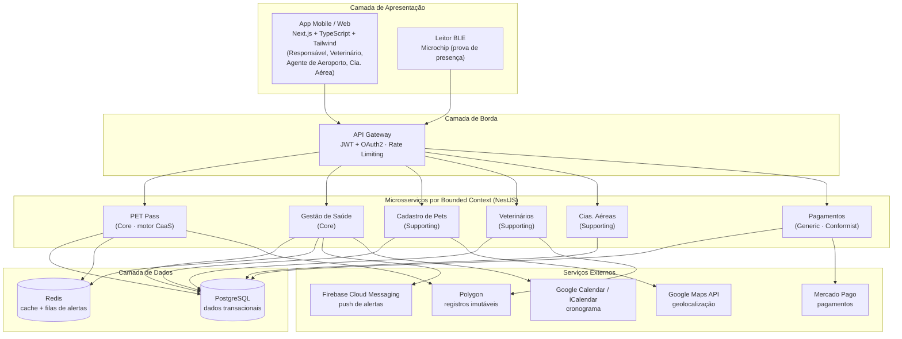
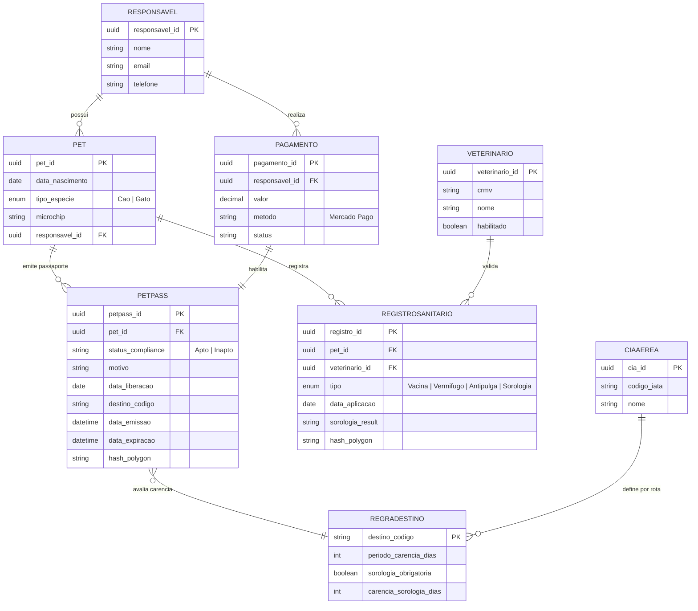
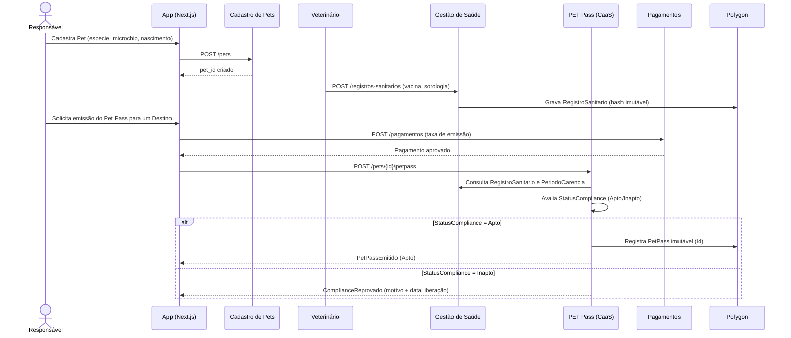
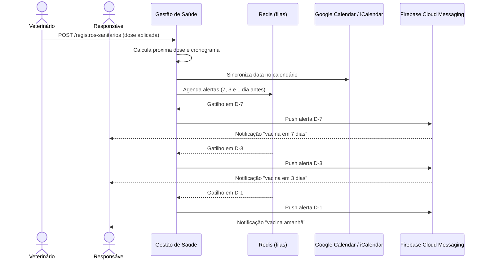
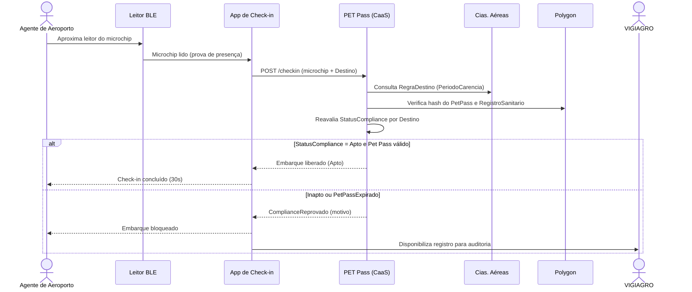

<style>
h1, h2 {
    font-weight: bold
}

table {
    display: block;
    width: 100%;
    overflow: auto;
    border-spacing: 0;
    border-collapse: collapse;
}

/* Header styling */
table th {
    font-weight: 600;
    background-color: #f6f8fa; /* Light grey header background */
}

/* Border and cell padding */
table th, table td {
    padding: 6px 13px;
    border: 1px solid #dfe2e5; /* Visible grid lines */
}

/* Zebra striping (alternate row colors) */
table tr:nth-child(2n) {
    background-color: #f6f8fa;
}

/* Background for all rows */
table tr {
    background-color: #fff;
    border-top: 1px solid #c6cbd1;
}

pre:nth-last-child(1 of pre) {
    padding: 0;
    // background-color: transparent;
    margin-bottom: 0;
    border: none;
}

:not(pre):not(.hljs) > code {
	background-color: rgb(239,241,242);
    padding: 1px 4px;
    border-radius: 4px;
    color: #000;
	font-size: 13px;
}
</style>

# Engenharia de Software 2.0: AI-Driven Development<br>01 - Criando a arquitetura de um sistema

**FIAP - MBA em Engenharia de Software - 10AOJR**

**Integrantes**

- `367438` - Brunna Cataryne Rosa Webster
- `366865` - Danielle Moreira
- `368605` - Leonardo Braga de Almeida
- `367369` - Victor Hugo dos Santos Telles

<br>

---

<br>

## 1. Visão Geral do Sistema

A **iPet** é uma plataforma Super App cujo produto de entrada é o **Smart Pet Pass**, um motor de **Compliance as a Service (CaaS)** que automatiza a validação sanitária de animais para embarque aéreo, reduzindo o check-in de 20 minutos para 30 segundos. O sistema avalia regras de **PeriodoCarencia** variáveis por **Destino** (Brasil: 21 dias para vacina antirrábica; UE: vacina + sorologia com 90 dias; Japão: vacina + sorologia com 180 dias) e emite um **StatusCompliance** (Apto/Inapto). O **Responsável** consulta o passaporte, o **Veterinário** registra cada **RegistroSanitario** e **SorologiaResult**, e o registro é gravado de forma imutável em blockchain Polygon. A prova de presença no check-in é feita via leitura BLE do microchip, eliminando erros humanos, multas de até €5.000 e deportações.

<br>

## 2. Funcionalidades Principais

| Módulo (Bounded Context)                | Funcionalidade                                                                                    | Ator Principal      |
| --------------------------------------- | ------------------------------------------------------------------------------------------------- | ------------------- |
| **PET Pass** _(Core)_                   | Emissão do Smart Pet Pass via motor CaaS (evento `PetPassEmitido`)                                | Sistema PET Pass    |
| **PET Pass** _(Core)_                   | Avaliação de `StatusCompliance` (Apto/Inapto + motivo + dataLiberação) por `Destino`              | Sistema PET Pass    |
| **PET Pass** _(Core)_                   | Aplicação das invariantes de carência (I1 21 dias / I2 UE 90 dias / I3 Japão 180 dias)            | Sistema PET Pass    |
| **PET Pass** _(Core)_                   | Disparo de `SorologiaRequerida` quando o `Destino` exige sorologia                                | Sistema PET Pass    |
| **PET Pass** _(Core)_                   | Reprovação de compliance (evento `ComplianceReprovado`)                                           | Sistema PET Pass    |
| **PET Pass** _(Core)_                   | Validação do passaporte no check-in (prova de presença via microchip BLE)                         | Agente de Aeroporto |
| **PET Pass** _(Core)_                   | Registro imutável do passaporte Apto em Polygon (invariante I4 — imutabilidade)                   | Sistema PET Pass    |
| **PET Pass** _(Core)_                   | Expiração do passaporte (evento `PetPassExpirado`)                                                | Sistema PET Pass    |
| **Gestão de Saúde** _(Core)_            | Registro de vacinas, vermífugos, antipulgas e sorologia (`RegistroSanitario` / `SorologiaResult`) | Veterinário         |
| **Gestão de Saúde** _(Core)_            | Cronograma de saúde e doses futuras                                                               | Responsável         |
| **Gestão de Saúde** _(Core)_            | Alertas proativos em 7, 3 e 1 dia antes da próxima dose (US001)                                   | Responsável         |
| **Cadastro de Pets** _(Supporting)_     | Cadastro de Pet (`pet_id`, `data_nascimento`, `tipo_especie` Cão/Gato, `microchip`)               | Responsável         |
| **Cadastro de Pets** _(Supporting)_     | Dados biométricos e vínculo Responsável–Pet                                                       | Responsável         |
| **Veterinários** _(Supporting)_         | Validação de profissionais habilitados                                                            | Sistema PET Pass    |
| **Veterinários** _(Supporting)_         | Emissão de atestados digitais                                                                     | Veterinário         |
| **Cias. Aéreas** _(Supporting)_         | Cadastro de regras específicas por companhia e rota                                               | Companhia Aérea     |
| **Cias. Aéreas** _(Supporting)_         | Consumo do resultado de compliance no check-in                                                    | Companhia Aérea     |
| **Pagamentos** _(Generic / Conformist)_ | Taxa de emissão de passaporte (B2B2C) via Mercado Pago                                            | Responsável         |
| **Pagamentos** _(Generic / Conformist)_ | Cobrança por check-in (B2B) via Mercado Pago                                                      | Companhia Aérea     |

<div style="page-break-after: always;"></div>

## 3. Tipos de Usuário e Permissões

| Perfil                                   | Módulos com Acesso                                      | Tipo de Permissão                                                                                                        |
| ---------------------------------------- | ------------------------------------------------------- | ------------------------------------------------------------------------------------------------------------------------ |
| **Responsável pelo Pet**                 | Cadastro de Pets; Gestão de Saúde; PET Pass; Pagamentos | Escrita (cadastro/pet), Leitura (cronograma, `StatusCompliance`, passaporte), Escrita (taxa de emissão)                  |
| **Veterinário**                          | Gestão de Saúde; Veterinários; Cadastro de Pets         | Escrita (`RegistroSanitario`, `SorologiaResult`, atestados), Leitura (dados do pet)                                      |
| **Agente de Aeroporto**                  | PET Pass                                                | Validação (check-in, leitura BLE do microchip, consulta de `StatusCompliance`)                                           |
| **Companhia Aérea**                      | Cias. Aéreas; PET Pass; Pagamentos                      | Administração (regras por rota/companhia), Leitura/Validação (resultado de compliance), Escrita (pagamento por check-in) |
| **Sistema PET Pass** _(motor de regras)_ | PET Pass; Gestão de Saúde; Veterinários                 | Administração/Validação (execução de regras, emissão), Leitura (registros sanitários, habilitação do veterinário)        |
| **VIGIAGRO** _(autoridade sanitária)_    | PET Pass; Gestão de Saúde                               | Leitura/Validação (auditoria sanitária do passaporte e registros)                                                        |

<br>

## 4. Diagrama de Arquitetura em Camadas



<div style="page-break-after: always;"></div>

## 5. Entidades Principais e Relacionamentos



<div style="page-break-after: always;"></div>

## 6. Endpoints da API REST

| Método HTTP | Rota                                  | Descrição                                                                 | Bounded Context  |
| ----------- | ------------------------------------- | ------------------------------------------------------------------------- | ---------------- |
| POST        | `/auth/login`                         | Autenticação e emissão de token JWT                                       | Autenticação     |
| POST        | `/auth/oauth2/callback`               | Login federado via OAuth2                                                 | Autenticação     |
| POST        | `/auth/refresh`                       | Renovação de token                                                        | Autenticação     |
| POST        | `/pets`                               | Cadastrar Pet (`data_nascimento`, `tipo_especie`, `microchip`)            | Cadastro de Pets |
| GET         | `/pets/{pet_id}`                      | Consultar dados cadastrais e biométricos do Pet                           | Cadastro de Pets |
| GET         | `/responsaveis/{id}/pets`             | Listar Pets de um Responsável                                             | Cadastro de Pets |
| POST        | `/pets/{pet_id}/registros-sanitarios` | Registrar vacina, vermífugo, antipulga ou sorologia (`RegistroSanitario`) | Gestão de Saúde  |
| GET         | `/pets/{pet_id}/registros-sanitarios` | Listar histórico sanitário e `SorologiaResult`                            | Gestão de Saúde  |
| GET         | `/pets/{pet_id}/cronograma`           | Consultar cronograma de doses futuras                                     | Gestão de Saúde  |
| GET         | `/pets/{pet_id}/alertas`              | Listar alertas proativos (7/3/1 dia — US001)                              | Gestão de Saúde  |
| POST        | `/pets/{pet_id}/petpass`              | Emitir Smart Pet Pass para um `Destino` (dispara `PetPassEmitido`)        | PET Pass         |
| GET         | `/petpass/{petpass_id}`               | Consultar passaporte e `StatusCompliance` (Apto/Inapto)                   | PET Pass         |
| POST        | `/petpass/{petpass_id}/compliance`    | Reavaliar compliance por `Destino` e `PeriodoCarencia`                    | PET Pass         |
| GET         | `/petpass/{petpass_id}/verificacao`   | Verificar registro imutável em Polygon (hash)                             | PET Pass         |
| POST        | `/checkin`                            | Validar embarque via leitura BLE do microchip + `StatusCompliance`        | PET Pass         |
| GET         | `/checkin/{checkin_id}`               | Consultar resultado do check-in                                           | PET Pass         |
| POST        | `/veterinarios/{id}/atestados`        | Emitir atestado digital                                                   | Veterinários     |
| GET         | `/veterinarios/{id}/validacao`        | Validar habilitação do profissional                                       | Veterinários     |
| POST        | `/cias-aereas/{cia_id}/regras`        | Cadastrar regra por companhia e rota                                      | Cias. Aéreas     |
| GET         | `/cias-aereas/{cia_id}/regras`        | Listar regras de uma companhia                                            | Cias. Aéreas     |
| GET         | `/destinos/{codigo}/regras`           | Consultar `RegraDestino` (carência, sorologia)                            | Cias. Aéreas     |
| POST        | `/pagamentos`                         | Processar taxa de emissão / check-in via Mercado Pago                     | Pagamentos       |
| GET         | `/pagamentos/{pagamento_id}`          | Consultar status do pagamento                                             | Pagamentos       |
| POST        | `/notificacoes/push`                  | Enviar notificação push (Firebase)                                        | Notificações     |
| GET         | `/notificacoes`                       | Listar notificações do Responsável                                        | Notificações     |

<br>

## 7. Tecnologias por Camada

| Camada                         | Tecnologia Sugerida                                      | Justificativa baseada nos requisitos da iPet                                                                                                                                                                        |
| ------------------------------ | -------------------------------------------------------- | ------------------------------------------------------------------------------------------------------------------------------------------------------------------------------------------------------------------- |
| **Frontend**                   | Next.js + TypeScript + Tailwind CSS                      | App único para Responsável, Veterinário, Agente de Aeroporto e Cia. Aérea; renderização rápida para o objetivo de check-in em 30 segundos; tipagem reduz erro humano na entrada de `RegistroSanitario`.             |
| **API Gateway / Autenticação** | JWT + OAuth2                                             | Distingue perfis com permissões diferentes (leitura/escrita/validação/administração) e isola o acesso de VIGIAGRO e Cias. Aéreas; OAuth2 viabiliza integração futura com sistemas aeroportuários (roadmap Q3/2028). |
| **Backend**                    | NestJS (TypeScript) — microsserviços por Bounded Context | Um serviço por BC permite escalar o motor **PET Pass** (CaaS) de forma independente conforme novas Cias. Aéreas entram; respeita as fronteiras de DDD e a relação Conformist com Pagamentos.                        |
| **Banco Relacional**           | PostgreSQL                                               | Dados transacionais de Pet, `RegistroSanitario`, `PetPass` e `Pagamento` exigem integridade referencial; suporta as invariantes I1–I3 (carência) com consultas determinísticas.                                     |
| **Cache e Filas**              | Redis                                                    | Suporta os alertas proativos 7/3/1 dia (US001) via filas e acelera a validação de `StatusCompliance` no check-in em tempo real, sustentando o alvo de 30 segundos.                                                  |
| **Infraestrutura**             | AWS ou GCP (serviços gerenciados) + Docker + Kubernetes  | Cloud-First da tríade tecnológica; escalabilidade elástica para múltiplas companhias aéreas e para a PoC em GRU; serviços gerenciados reduzem custo operacional de uma startup early-stage.                         |
| **Blockchain**                 | Polygon                                                  | Registro imutável e verificável de vacinas, sorologia e atestados; sustenta a invariante I4 (imutabilidade do passaporte Apto) e elimina fraudes nos registros sanitários.                                          |
| **IoT**                        | Bluetooth Low Energy (BLE)                               | Leitura do `microchip` como prova de presença do animal no check-in, vinculando o `PetPass` ao pet físico embarcado.                                                                                                |
| **Notificações**               | Firebase Cloud Messaging                                 | Entrega os alertas de cronograma (US001) ao Responsável e o resultado de compliance (Apto/Inapto) em tempo hábil.                                                                                                   |
| **Geolocalização**             | Google Maps API                                          | Localização de clínicas habilitadas e do aeroporto no fluxo de check-in.                                                                                                                                            |
| **Calendário**                 | Google Calendar / Outlook / iCalendar                    | Sincroniza o cronograma de doses e respeita os marcos de `PeriodoCarencia` antes da data de viagem.                                                                                                                 |
| **Pagamentos**                 | Mercado Pago                                             | Processa a taxa de emissão (B2B2C) e a cobrança por check-in (B2B); relação Conformist do BC Pagamentos, sem acoplamento ao core.                                                                                   |

<div style="page-break-after: always;"></div>

## 8. Fluxos Principais

### Fluxo 1 — Cadastro de Pet e Emissão do Smart Pet Pass



<br>

### Fluxo 2 — Gestão de Cronograma de Saúde com Alertas Proativos (US001)



<div style="page-break-after: always;"></div>

### Fluxo 3 — Check-in Aéreo com Validação de Compliance Sanitário por Destino



<div style="page-break-after: always;"></div>

## 9. Prompts Utilizados

Este documento foi gerado com **Claude Opus 4.8 (Anthropic)**.<br>Abaixo, o prompt original utilizado:

````text
# Contexto

Aja como um Principal Software Architect com experiência em Domain-Driven Design, sistemas distribuídos e plataformas SaaS B2B para o mercado de aviação e saúde pet. Você tem acesso completo à documentação técnica e estratégica da startup iPet, descrita abaixo.

A iPet é uma plataforma Super App cujo produto de entrada é o **Smart Pet Pass**: um motor de Compliance as a Service (CaaS) que automatiza a validação sanitária de animais de estimação para embarque aéreo, reduzindo o check-in de 20 minutos para 30 segundos. A plataforma resolve o problema de regras sanitárias variáveis por país (Brasil: 21 dias de carência para vacina antirrábica; União Europeia: vacina + sorologia com 90 dias de carência; Japão: vacina + sorologia com 180 dias de carência) que hoje resultam em erros humanos, multas de até €5.000 por animal e deportações traumáticas.

A tríade tecnológica do produto é:
- **Cloud-First**: infraestrutura escalável e resiliente
- **IoT Bluetooth**: leitura de microchip para prova de presença no check-in
- **Blockchain Polygon**: registros imutáveis e verificáveis de vacinas e exames, eliminando fraudes

A arquitetura de domínio já foi modelada via DDD com os seguintes Bounded Contexts:
- **PET Pass** (Core Domain): motor de compliance sanitário, emissão e validação do passaporte digital. Aggregate Root: `PetPass`. Value Objects: `StatusCompliance` (Apto/Inapto + motivo + dataLiberação), `Destino` (código + regras de carência), `Microchip`. Invariantes críticas: carência mínima de 21 dias para vacina antirrábica (I1); sorologia obrigatória com 90 dias para UE (I2) e 180 dias para Japão (I3); imutabilidade do passaporte emitido como Apto (I4).
- **Gestão de Saúde** (Core Domain): registros de vacinas, vermífugos, antipulgas e sorologia; alertas proativos em 7, 3 e 1 dia antes da próxima dose.
- **Cadastro de Pets** (Supporting): dados biométricos e cadastrais (Pet: `pet_id`, `data_nascimento`, `tipo_especie` ENUM Cão/Gato, `microchip`).
- **Veterinários** (Supporting): validação de profissionais e emissão de atestados digitais.
- **Cias. Aéreas** (Supporting): regras específicas por companhia e rota.
- **Pagamentos** (Generic): processamento via Mercado Pago (Conformist).

Atores do sistema: Responsável pelo Pet, Veterinário, Agente de Aeroporto, Companhia Aérea, Sistema PET Pass (motor de regras), VIGIAGRO.

Eventos de domínio mapeados: `PetPassEmitido`, `ComplianceReprovado`, `PetPassExpirado`, `SorologiaRequerida`.

Modelo de negócio: SaaS B2B (receita por check-in, pago por Companhias Aéreas) + SaaS B2B2C (taxa de emissão de passaporte, pago por Clínicas Veterinárias e usuários finais).

Roadmap: MVP Brasil (Q1/2027, voos domésticos e internacionais diretos) → Conexões Globais (Q3/2027) → Expansão EMEA (Q1/2028) → Integração Total com sistemas aeroportuários (Q3/2028). PoC planejada no Aeroporto de Guarulhos (GRU).

# Tarefa

Antes de gerar qualquer conteúdo, pense passo a passo:

Passo 1 — Com base no DDD e nos Bounded Contexts acima, identifique as funcionalidades principais agrupadas por módulo e os tipos de usuário com suas permissões em cada módulo.

Passo 2 — Com base nas funcionalidades, nos atores e nas integrações externas, proponha a arquitetura em camadas (frontend, backend, banco de dados, serviços externos), justificando cada decisão tecnológica em função dos requisitos da iPet: imutabilidade dos registros sanitários, validação em tempo real no check-in, escalabilidade para múltiplas companhias aéreas e conformidade com LGPD.

Passo 3 — Com base nos Aggregates e Value Objects do DDD, modele as entidades principais e seus relacionamentos.

Passo 4 — Com base nos Bounded Contexts, nos comandos e eventos do Event Storming, defina os principais endpoints REST da API, agrupados por domínio.

Passo 5 — Descreva os três fluxos principais do sistema: (a) cadastro de pet e emissão do Smart Pet Pass, (b) gestão de cronograma de saúde com alertas proativos, (c) check-in aéreo com validação de compliance sanitário por destino.

Depois de concluir os cinco passos de raciocínio, gere o documento final no formato `.md`.

# Restrições

- Use estritamente as informações documentadas no repositório iPet. Não invente funcionalidades, entidades ou regras de negócio ausentes da documentação.
- Não use termos vagos como "boas práticas" ou "código limpo". Toda restrição técnica deve ser específica e rastreável ao contexto da iPet.
- Não recomende tecnologias incompatíveis com uma startup early-stage (sem Oracle, SAP, mainframes ou soluções enterprise de alto custo).
- Respeite a Linguagem Ubíqua do domínio: use os termos Pet Pass, Compliance as a Service (CaaS), Responsável, StatusCompliance (Apto/Inapto), Destino, RegistroSanitario, SorologiaResult, PeriodoCarencia, PetPassEmitido, ComplianceReprovado.

# Tecnologias Sugeridas

As tecnologias abaixo são recomendações de ponto de partida para a implementação, a serem validadas e detalhadas na arquitetura gerada. Organize-as por setor:

**Frontend**
- Framework: Next.js + TypeScript
- Estilização: Tailwind CSS

**Backend**
- Framework: NestJS (TypeScript)
- Autenticação: JWT + OAuth2

**Banco de Dados**
- Relacional: PostgreSQL (dados transacionais)
- Cache e filas: Redis

**Infraestrutura**
- Cloud-First: AWS ou GCP (serviços gerenciados)
- Containerização: Docker + Kubernetes

**Blockchain**
- Rede: Polygon
- Finalidade: imutabilidade e verificabilidade dos registros sanitários (vacinas, sorologia, atestados)

**IoT**
- Protocolo: Bluetooth Low Energy (BLE) para leitura de microchip no check-in

**Integrações Externas**
- Notificações push: Firebase Cloud Messaging
- Geolocalização: Google Maps API
- Calendário: Google Calendar / Outlook / iCalendar
- Pagamentos: Mercado Pago

# Formato de Saída

Gere um documento completo em Markdown, seguindo estritamente este template, seção por seção:

## 1. Visão Geral do Sistema
> Descrição objetiva da iPet e do Smart Pet Pass em até 5 linhas, usando a Linguagem Ubíqua do domínio

## 2. Funcionalidades Principais
> Tabela: Módulo (Bounded Context) | Funcionalidade | Ator Principal

## 3. Tipos de Usuário e Permissões
> Tabela: Perfil | Módulos com Acesso | Tipo de Permissão (leitura / escrita / validação / administração)

## 4. Diagrama de Arquitetura em Camadas
> Diagrama obrigatório em Mermaid — graph TD — cobrindo: App Mobile/Web → API Gateway → Microsserviços por Bounded Context → Bancos de Dados → Serviços Externos (Polygon, Firebase, Google Maps, Mercado Pago)

## 5. Entidades Principais e Relacionamentos
> Diagrama obrigatório em Mermaid — erDiagram — com as entidades: PetPass, Pet, Responsavel, RegistroSanitario, Veterinario, CiaAerea, RegraDestino, Pagamento

## 6. Endpoints da API REST
> Tabela: Método HTTP | Rota | Descrição | Bounded Context
> Cobrir obrigatoriamente: autenticação, pets, passaportes, registros sanitários, compliance, check-in, companhias aéreas, notificações

## 7. Tecnologias por Camada
> Tabela: Camada | Tecnologia Sugerida | Justificativa baseada nos requisitos da iPet

## 8. Fluxos Principais
> Três diagramas obrigatórios em Mermaid — sequenceDiagram:
>  - Fluxo 1: Cadastro de pet e emissão do Smart Pet Pass
>  - Fluxo 2: Gestão de cronograma de saúde com alertas proativos (US001)
>  - Fluxo 3: Check-in aéreo com validação de compliance sanitário por destino

## 9. Prompts Utilizados
> Registrar que este documento foi gerado com Claude Opus 4.8 (Anthropic). Nesta seção, replique o texto deste prompt no formato original, ou seja, use da sintaxe de "bloco de código cercado" (```) para "embrulhar" este texto.
````
